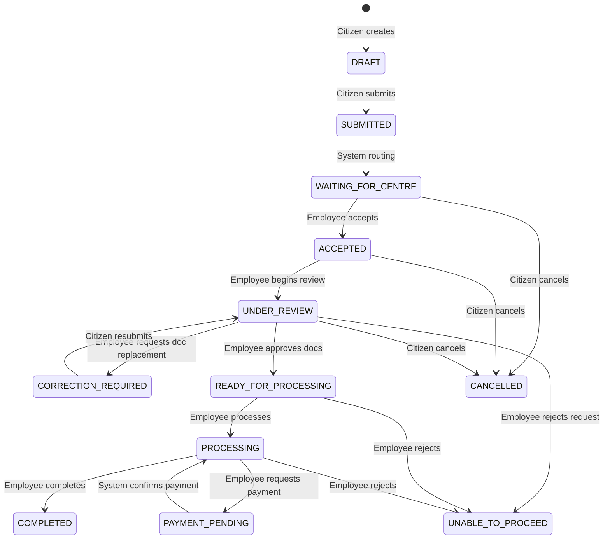

# Centre Employee Workflow

## End-to-End Workflow
1. **Intake**: A request created by a citizen enters the system. After routing to a specific centre, it enters the `WAITING_FOR_CENTRE` state.
2. **Acceptance (Claiming)**: An employee at the targeted centre views the queue and accepts the request. This assigns the request to the employee and transitions it to `ACCEPTED`.
3. **Verification**: The employee starts the review process, transitioning the request to `UNDER_REVIEW`.
4. **Document Review**: The employee reviews each uploaded document:
   - If **APPROVED**, the document is marked as `VERIFIED`.
   - If **REPLACEMENT_REQUESTED**, the document is marked as `REUPLOAD_REQUIRED` and the request transitions to `CORRECTION_REQUIRED`.
   - If **REJECTED**, the document is marked as `REJECTED` and the request transitions to `CORRECTION_REQUIRED`.
   - If the citizen is fundamentally ineligible, the employee transitions the entire request to `UNABLE_TO_PROCEED`.
5. **Processing**: Once documents are in order, the request transitions through `READY_FOR_PROCESSING` and `PROCESSING`. Additional steps like `INTERACTION_REQUIRED` and `PAYMENT_PENDING` may occur.
6. **Completion**: Upon successful processing, the request is marked `COMPLETED`.

## State Transitions
| Current State | Allowed Next States | Triggered By |
| --- | --- | --- |
| `WAITING_FOR_CENTRE` | `ACCEPTED`, `CANCELLED` | `centre_employee` (Accept), `citizen` (Cancel) |
| `ACCEPTED` | `UNDER_REVIEW`, `UNABLE_TO_PROCEED`, `CANCELLED` | `centre_employee` (Review, Reject), `citizen` (Cancel) |
| `UNDER_REVIEW` | `CORRECTION_REQUIRED`, `INTERACTION_REQUIRED`, `READY_FOR_PROCESSING`, `UNABLE_TO_PROCEED`, `CANCELLED` | `centre_employee` (various), `citizen` (Cancel) |
| `CORRECTION_REQUIRED` | `UNDER_REVIEW`, `INTERACTION_REQUIRED`, `UNABLE_TO_PROCEED`, `CANCELLED` | `citizen` (Resubmit), `centre_employee` |
| `INTERACTION_REQUIRED` | `INTERACTION_SCHEDULED`, `UNABLE_TO_PROCEED`, `CANCELLED` | `citizen`, `centre_employee` |
| `INTERACTION_SCHEDULED` | `UNDER_REVIEW`, `INTERACTION_REQUIRED`, `UNABLE_TO_PROCEED`, `CANCELLED` | `centre_employee`, `system`, `citizen` |
| `READY_FOR_PROCESSING`| `PROCESSING`, `UNABLE_TO_PROCEED` | `centre_employee` |
| `PROCESSING` | `PAYMENT_PENDING`, `COMPLETED`, `UNABLE_TO_PROCEED` | `centre_employee` |
| `PAYMENT_PENDING` | `PROCESSING`, `COMPLETED`, `UNABLE_TO_PROCEED`, `CANCELLED` | `system` (Payment success), `centre_employee` |

## Document Verification & Rejection
- When a document is rejected or marked for replacement, the document itself changes status (`REUPLOAD_REQUIRED` or `REJECTED`), and the parent request is automatically transitioned to `CORRECTION_REQUIRED`.
- The citizen must re-upload the document and resubmit the request to move it back to `UNDER_REVIEW`.
- An ineligible citizen leads the employee to reject the *entire request* by moving it to `UNABLE_TO_PROCEED`. 

## Centre Scoping
Requests are scoped by the `selected_centre_id`. According to the implementation in `api/endpoints/requests.py`:
- `centre_employee` users can only list and view requests where `selected_centre_id` matches their own `centre_id`.
- Furthermore, an employee must have an `approval_status` of `APPROVED` to view requests.

## Request Limits & Acceptance
- **Limit ENFORCED**: Yes, the system enforces a limit on active claims.
- Specifically, the `accept_request` endpoint checks `active_count >= employee.max_active_requests`. If the limit is reached, it raises a 409 error: "Employee at maximum capacity".

## Notifications
- The system fires automated notifications on state changes using `_safe_add_notification`.
- During document correction, a notification is explicitly dispatched to the citizen with the reason.
- When an employee is assigned to a request or the request is cancelled, notifications are logged.

## Account Approval Flow
- Centre Employees are approved by the `centre_administrator`.
- `centre_administrator` accounts are approved by a `system_administrator`.
- An employee cannot view centre requests until their `approval_status` is updated to `APPROVED`.

## Mermaid Diagram

## Gaps & Inconsistencies
- `CANCELLED` is an allowed transition from `PAYMENT_PENDING`, which may complicate refunds if the cancellation occurs concurrently with a payment attempt.
- Document rejection transitions the request to `CORRECTION_REQUIRED`, but does not verify if multiple documents are simultaneously rejected (though this is mitigated by the atomic nature of the review endpoint, doing it in bulk might be cleaner).
- The transition from `DRAFT` to `SUBMITTED` involves citizen action, but `SUBMITTED` immediately transitions to `WAITING_FOR_CENTRE` via the `SUBMIT_REQUEST_ROUTING` action in the same API call. `SUBMITTED` is basically transient.
